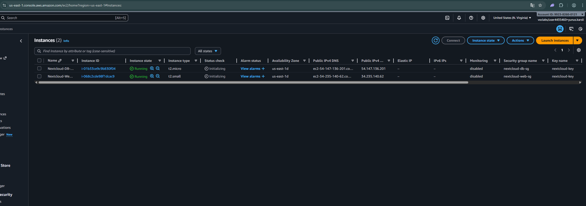

# Testdokumentation - M346 Nextcloud auf AWS

  

  

  

## Übersicht

  

  

  

Diese Dokumentation enthält alle durchgeführten Tests zur Validierung der Nextcloud-Installation auf AWS EC2.

  

  

  

---

  

  

  

## Test 1: Deployment der EC2-Instanzen

  

  

  

### Testinformationen

  

  

  

Testzeitpunkt: 17.12.2025 22:39:55

  

  

Testperson: Emre

  

  

  

### Testbeschreibung

  

  

  

Ausführung des `install.ps1` Skripts zur automatisierten Erstellung der beiden EC2-Instanzen (Webserver und DB-Server).

  

  

  

### Erwartetes Ergebnis

  

  

  

- Zwei EC2-Instanzen werden erstellt

  

  

- Beide Instanzen sind im Status "running"

  

  

- Public IP-Adressen werden angezeigt

  

  

- Keine Fehlermeldungen im Skript

  

  

  

### Tatsächliches Ergebnis

- Das Skript `install.ps1` hat ohne Probleme funktioniert.

- Zwei EC2-Instanzen (Webserver und DB-Server) wurden erfolgreich erstellt.

- Beide Instanzen sind aktiv und haben den Status „running“.

- Die öffentlichen IP-Adressen sind sichtbar.

- Es gab keine Fehlermeldungen während der Installation.

  

  

  

### Screenshot

  

  

```markdown



```

  

  

### Fazit

  

Der Test war **erfolgreich**. Das Skript arbeitet perfekt und automatisiert die Erstellung der Server schnell und sicher. Alle Erwartungen wurden erfüllt.

  

  

  

---

  

  

  

## Test 2: Datenbankverbindung (MariaDB)

  

  

  

### Testinformationen

  

  

  

Testzeitpunkt: 17.12.2025 23:00:55

  

  

Testperson: Emre

  

  

  

### Testbeschreibung

  

  

  

Überprüfung der MariaDB-Installation und Erreichbarkeit vom Webserver aus.

  

  

  

### Testschritte

  

  

  

1. SSH-Verbindung zum DB-Server herstellen

  

  

2. MariaDB-Status prüfen: `sudo systemctl status mariadb`

  

  

3. Datenbank-Verbindung testen: `mysql -u nextcloud -p -h localhost`

  

  

4. Nextcloud-Datenbank prüfen: `SHOW DATABASES;`

  

  
  

  

  

### Erwartetes Ergebnis

  

  

  

- MariaDB läuft (active/running)

  

  

- Benutzer "nextcloud" kann sich anmelden

  

  

- Datenbank "nextcloud" existiert

  

  

  

### Tatsächliches Ergebnis

  

- Ich konnte mich ohne Probleme über SSH mit dem DB-Server verbinden.

- Der MariaDB-Status wurde geprüft: Der Dienst ist „active (running)“.

- Die Anmeldung mit dem Benutzer „nextcloud“ hat sofort funktioniert.

- Mit dem Befehl `SHOW DATABASES;` habe ich gesehen, dass die Datenbank „nextcloud“ existiert.

  

  

### Screenshot

  

  

  

  

  

### Fazit

  

  

Der Test war **erfolgreich**. Die Datenbank ist richtig installiert und konfiguriert. Der Zugriff funktioniert wie geplant und alle wichtigen Daten sind vorhanden.

  

  

  

---

  

  

  

## Test 3: Nextcloud Login und Funktionalität

  

  

  

### Testinformationen

  

  

  

Testzeitpunkt: 17.12.2025 23:20:49

  

  

Testperson: Emre

  

  

  

### Testbeschreibung

  

  

  

Anmeldung mit dem erstellten Admin-Konto und Test der Grundfunktionen.

  

  

  

### Testschritte

  

  

  

1. Login mit Admin-Zugangsdaten

  

  

2. Dashboard wird angezeigt

  

  

3. Neue Datei hochladen

  

  

4. Neuen Ordner erstellen

  

  

5. Datei herunterladen

  

  

  

### Erwartetes Ergebnis

  

  

  

- Erfolgreicher Login

  

  

- Dashboard wird korrekt angezeigt

  

  

- Datei-Upload funktioniert

  

  

- Ordner-Erstellung funktioniert

  

  

- Download funktioniert

  

  

  

### Tatsächliches Ergebnis

  -   Die Anmeldung mit den Admin-Daten war erfolgreich.
    
-   Das Dashboard wird richtig angezeigt und sieht gut aus.
    
-   Ich konnte eine neue Datei ohne Fehler hochladen.
    
-   Das Erstellen von einem neuen Ordner hat funktioniert.
    
-   Der Download der Datei war ebenfalls erfolgreich.

  

  

  

### Screenshots

  

  

  

  

### Fazit

  
Der Test war **erfolgreich**. Alle Grundfunktionen von Nextcloud arbeiten ohne Probleme. Die Plattform ist bereit für die Nutzung.
  

  

  

---

  

  

  

## Test 4: Cleanup-Skript

  

  

  

### Testinformationen

  

  

  

Testzeitpunkt:

  

  

Testperson:

  

  

  

### Testbeschreibung

  

  

  

Ausführung des `uninstall.ps1` Skripts zur Bereinigung aller AWS-Ressourcen.

  

  

  

### Erwartetes Ergebnis

  

  

  

- Alle EC2-Instanzen werden terminiert

  

  

- Security Groups werden gelöscht

  

  

- Key Pairs werden entfernt

  

  

- AWS Console zeigt keine Ressourcen mehr

  

  

  

### Tatsächliches Ergebnis

  

  

  

  

### Screenshot

  

  

  

  

### Fazit

  

  

  

  

---